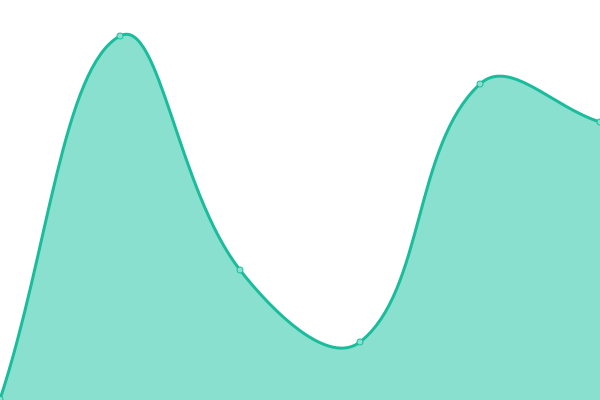
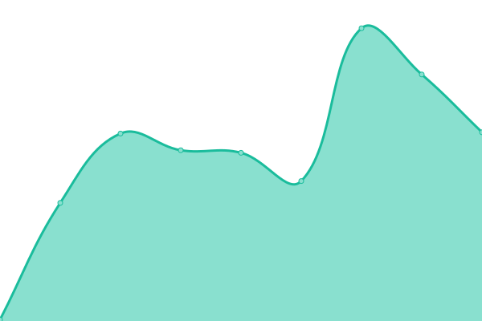

# [📈 Live Status](https://upptime.github.io/upptime): <!--live status--> **🟩 All systems operational**

This repository contains the open-source uptime monitor and status page for [Upptime](https://upptime.js.org), powered by [Upptime](https://github.com/upptime/upptime).

With [Upptime](https://upptime.js.org), you can get your own unlimited and free uptime monitor and status page, powered entirely by a GitHub repository. We use [Issues](https://github.com/upptime/upptime/issues) as incident reports, [Actions](https://github.com/upptime/upptime/actions) as uptime monitors, and [Pages](https://upptime.github.io/upptime) for the status page.

<!--start: status pages-->
<!-- This summary is generated by Upptime (https://github.com/upptime/upptime) -->
<!-- Do not edit this manually, your changes will be overwritten -->

| URL                                       | Status | History                                                                                        | Response Time                                                                    | Uptime                                                                                                                                                                                                                     |
| ----------------------------------------- | ------ | ---------------------------------------------------------------------------------------------- | -------------------------------------------------------------------------------- | -------------------------------------------------------------------------------------------------------------------------------------------------------------------------------------------------------------------------- |
| [Rich Holman](https://www.richholman.com) | 🟩 Up  | [rich-holman.yml](https://github.com/dogwonder/upptime/commits/master/history/rich-holman.yml) |  280ms |  |
| [Dogwonder](https://dogwonder.co.uk)      | 🟩 Up  | [dogwonder.yml](https://github.com/dogwonder/upptime/commits/master/history/dogwonder.yml)     |  381ms   |      |
| [ONE](https://m.one.org/)                 | 🟩 Up  | [one.yml](https://github.com/dogwonder/upptime/commits/master/history/one.yml)                 |  442ms         |                   |

<!--end: status pages-->

[**Visit our status website →**](https://upptime.github.io/upptime)

## 📄 License

- Powered by: [Upptime](https://github.com/upptime/upptime)
- Code: [MIT](./LICENSE) © [Upptime](https://upptime.js.org)
- Data in the `./history` directory: [Open Database License](https://opendatacommons.org/licenses/odbl/1-0/)
