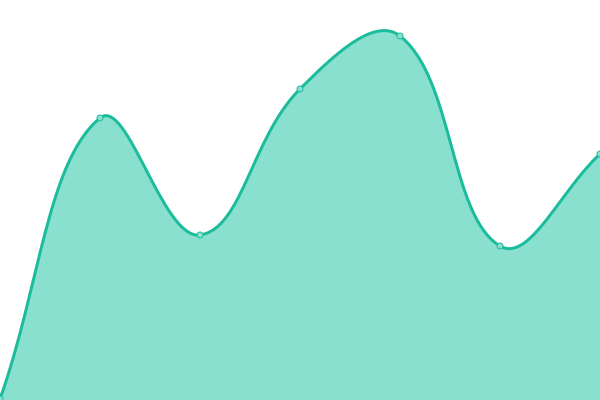

# [📈 Live Status](https://upptime.github.io/upptime): <!--live status--> **🟩 All systems operational**

This repository contains the open-source uptime monitor and status page for [Upptime](https://upptime.js.org), powered by [Upptime](https://github.com/upptime/upptime).

With [Upptime](https://upptime.js.org), you can get your own unlimited and free uptime monitor and status page, powered entirely by a GitHub repository. We use [Issues](https://github.com/upptime/upptime/issues) as incident reports, [Actions](https://github.com/upptime/upptime/actions) as uptime monitors, and [Pages](https://upptime.github.io/upptime) for the status page.

<!--start: status pages-->
<!-- This summary is generated by Upptime (https://github.com/upptime/upptime) -->
<!-- Do not edit this manually, your changes will be overwritten -->

| URL                                                 | Status | History                                                                                                | Response Time                                                                        | Uptime                                                                                                                                                                                                                             |
| --------------------------------------------------- | ------ | ------------------------------------------------------------------------------------------------------ | ------------------------------------------------------------------------------------ | ---------------------------------------------------------------------------------------------------------------------------------------------------------------------------------------------------------------------------------- |
| [Rich Holman](https://www.richholman.com)           | 🟩 Up  | [rich-holman.yml](https://github.com/dogwonder/upptime/commits/master/history/rich-holman.yml)         |  255ms     |          |
| [Dogwonder](https://dogwonder.co.uk)                | 🟩 Up  | [dogwonder.yml](https://github.com/dogwonder/upptime/commits/master/history/dogwonder.yml)             |  353ms       |              |
| [Seasonal Today](https://seasonal.today/)           | 🟩 Up  | [seasonal-today.yml](https://github.com/dogwonder/upptime/commits/master/history/seasonal-today.yml)   |  115ms  |    |
| [Juckwonder](https://juckwonder.com/)               | 🟩 Up  | [juckwonder.yml](https://github.com/dogwonder/upptime/commits/master/history/juckwonder.yml)           |  137ms      |            |
| [Phonebox Photos](http://phonebox.photos/)          | 🟩 Up  | [phonebox-photos.yml](https://github.com/dogwonder/upptime/commits/master/history/phonebox-photos.yml) |  218ms |  |
| [Tropical Isles](https://tropicalislescarnival.org) | 🟩 Up  | [tropical-isles.yml](https://github.com/dogwonder/upptime/commits/master/history/tropical-isles.yml)   |  670ms  |    |
| [ccco.bike](https://ccco.bike/)                     | 🟩 Up  | [ccco-bike.yml](https://github.com/dogwonder/upptime/commits/master/history/ccco-bike.yml)             |  2176ms      |              |
| [Greenhill 50](https://greenhill50.com/)            | 🟩 Up  | [greenhill-50.yml](https://github.com/dogwonder/upptime/commits/master/history/greenhill-50.yml)       |  149ms    |        |

<!--end: status pages-->

[**Visit our status website →**](https://upptime.github.io/upptime)

## 📄 License

- Powered by: [Upptime](https://github.com/upptime/upptime)
- Code: [MIT](./LICENSE) © [Upptime](https://upptime.js.org)
- Data in the `./history` directory: [Open Database License](https://opendatacommons.org/licenses/odbl/1-0/)
