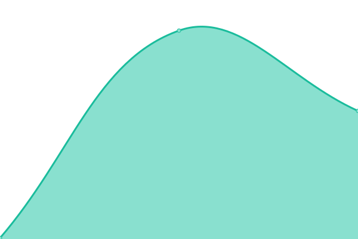

# [📈 Live Status](https://upptime.github.io/upptime): <!--live status--> **🟩 All systems operational**

This repository contains the open-source uptime monitor and status page for [Upptime](https://upptime.js.org), powered by [Upptime](https://github.com/upptime/upptime).

With [Upptime](https://upptime.js.org), you can get your own unlimited and free uptime monitor and status page, powered entirely by a GitHub repository. We use [Issues](https://github.com/upptime/upptime/issues) as incident reports, [Actions](https://github.com/upptime/upptime/actions) as uptime monitors, and [Pages](https://upptime.github.io/upptime) for the status page.

<!--start: status pages-->
<!-- This summary is generated by Upptime (https://github.com/upptime/upptime) -->
<!-- Do not edit this manually, your changes will be overwritten -->
<!-- prettier-ignore -->
| URL | Status | History | Response Time | Uptime |
| --- | ------ | ------- | ------------- | ------ |
| [Rich Holman](https://www.richholman.com) | 🟩 Up | [rich-holman.yml](https://github.com/dogwonder/upptime/commits/master/history/rich-holman.yml) | 

 264ms
     
 | 

   

| [Dogwonder](https://dogwonder.co.uk) | 🟩 Up | [dogwonder.yml](https://github.com/dogwonder/upptime/commits/master/history/dogwonder.yml) | 

 375ms
     
 | 

   

| [Seasonal Today](https://seasonal.today/) | 🟩 Up | [seasonal-today.yml](https://github.com/dogwonder/upptime/commits/master/history/seasonal-today.yml) | 

 164ms
     
 | 

   

| [Juckwonder](https://juckwonder.com/) | 🟩 Up | [juckwonder.yml](https://github.com/dogwonder/upptime/commits/master/history/juckwonder.yml) | 

 115ms
     
 | 

   

| [Phonebox Photos](http://phonebox.photos/) | 🟩 Up | [phonebox-photos.yml](https://github.com/dogwonder/upptime/commits/master/history/phonebox-photos.yml) | 

 151ms
     
 | 

   

| [Tropical Isles](https://tropicalislescarnival.org) | 🟩 Up | [tropical-isles.yml](https://github.com/dogwonder/upptime/commits/master/history/tropical-isles.yml) | 

 582ms
     
 | 

   

| [ccco.bike](https://ccco.bike/) | 🟩 Up | [ccco-bike.yml](https://github.com/dogwonder/upptime/commits/master/history/ccco-bike.yml) | 

 2218ms
     
 | 

   

| [Greenhill 50](https://greenhill50.com/) | 🟩 Up | [greenhill-50.yml](https://github.com/dogwonder/upptime/commits/master/history/greenhill-50.yml) | 

 139ms
     
 | 

   

<!--end: status pages-->

[**Visit our status website →**](https://upptime.github.io/upptime)

## 📄 License

- Powered by: [Upptime](https://github.com/upptime/upptime)
- Code: [MIT](./LICENSE) © [Upptime](https://upptime.js.org)
- Data in the `./history` directory: [Open Database License](https://opendatacommons.org/licenses/odbl/1-0/)
