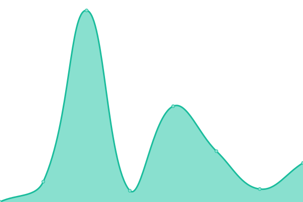

# [📈 Live Status](https://upptime.github.io/upptime): <!--live status--> **🟧 Partial outage**

This repository contains the open-source uptime monitor and status page for [Upptime](https://upptime.js.org), powered by [Upptime](https://github.com/upptime/upptime).

With [Upptime](https://upptime.js.org), you can get your own unlimited and free uptime monitor and status page, powered entirely by a GitHub repository. We use [Issues](https://github.com/upptime/upptime/issues) as incident reports, [Actions](https://github.com/dogwonder/upptime/actions) as uptime monitors, and [Pages](https://upptime.github.io/upptime) for the status page.

<!--start: status pages-->
<!-- This summary is generated by Upptime (https://github.com/upptime/upptime) -->
<!-- Do not edit this manually, your changes will be overwritten -->
<!-- prettier-ignore -->
| URL | Status | History | Response Time | Uptime |
| --- | ------ | ------- | ------------- | ------ |
|  [Rich Holman](https://www.richholman.com) | 🟩 Up | [rich-holman.yml](https://github.com/dogwonder/upptime/commits/HEAD/history/rich-holman.yml) | 

 277ms
     
 | 

<a href="https://dogwonder.github.io/upptime/history/rich-holman">100.00%</a>
    

|  [DGW.ltd - WordPress](https://wp.dgw.ltd) | 🟩 Up | [dgw-ltd-word-press.yml](https://github.com/dogwonder/upptime/commits/HEAD/history/dgw-ltd-word-press.yml) | 

 493ms
     
 | 

<a href="https://dogwonder.github.io/upptime/history/dgw-ltd-word-press">100.00%</a>
    

|  [Seasonal Today](https://seasonal.today/) | 🟩 Up | [seasonal-today.yml](https://github.com/dogwonder/upptime/commits/HEAD/history/seasonal-today.yml) | 

 220ms
     
 | 

<a href="https://dogwonder.github.io/upptime/history/seasonal-today">98.58%</a>
    

|  [Juckwonder](https://njk.dgw.ltd) | 🟥 Down | [juckwonder.yml](https://github.com/dogwonder/upptime/commits/HEAD/history/juckwonder.yml) | 

 208ms
     
 | 

<a href="https://dogwonder.github.io/upptime/history/juckwonder">0.00%</a>
    

|  [Phonebox Photos](http://phonebox.photos/) | 🟩 Up | [phonebox-photos.yml](https://github.com/dogwonder/upptime/commits/HEAD/history/phonebox-photos.yml) | 

 200ms
     
 | 

<a href="https://dogwonder.github.io/upptime/history/phonebox-photos">100.00%</a>
    

|  [ccco.bike](https://ccco.bike/) | 🟩 Up | [ccco-bike.yml](https://github.com/dogwonder/upptime/commits/HEAD/history/ccco-bike.yml) | 

 1413ms
     
 | 

<a href="https://dogwonder.github.io/upptime/history/ccco-bike">100.00%</a>
    

|  [Greenhill 50](https://greenhill50.com/) | 🟩 Up | [greenhill-50.yml](https://github.com/dogwonder/upptime/commits/HEAD/history/greenhill-50.yml) | 

 115ms
     
 | 

<a href="https://dogwonder.github.io/upptime/history/greenhill-50">100.00%</a>
    

<!--end: status pages-->

[**Visit our status website →**](https://upptime.github.io/upptime)

## 📄 License

- Powered by: [Upptime](https://github.com/upptime/upptime)
- Code: [MIT](./LICENSE) © [Upptime](https://upptime.js.org)
- Data in the `./history` directory: [Open Database License](https://opendatacommons.org/licenses/odbl/1-0/)
